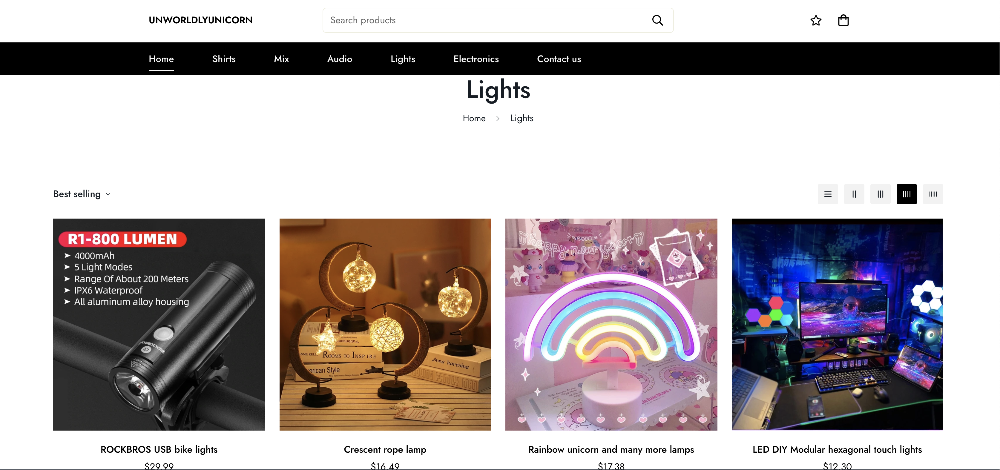
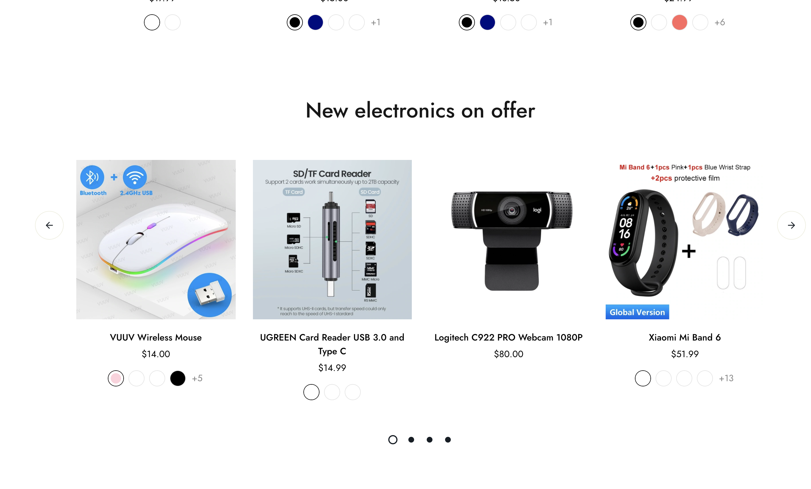
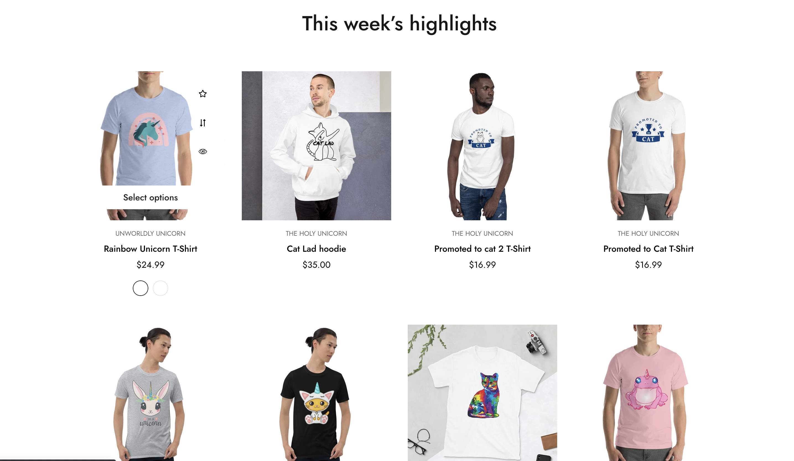

Lorem ipsum dolor sit amet, consectetur adipiscing elit. Duis posuere tellus ac convallis placerat. Proin tincidunt magna sed ex sollicitudin condimentum. Sed ac faucibus dolor, scelerisque sollicitudin nisi. Cras purus urna, suscipit quis sapien eu, pulvinar tempor diam. Quisque risus orci, mollis id ante sit amet, gravida egestas nisl. Sed ac tempus magna. Proin in dui enim. Donec condimentum, sem id dapibus fringilla, tellus enim condimentum arcu, nec volutpat est felis vel metus. Vestibulum sit amet erat at nulla eleifend gravida.

